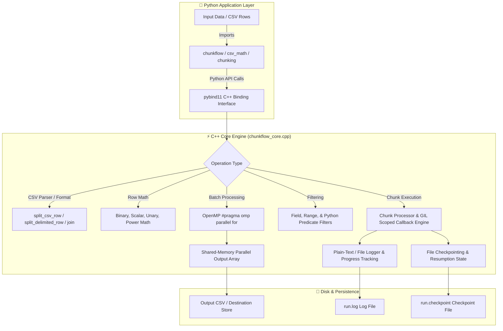

# 🌊 ChunkFlow

**High-Performance C++ Accelerated CSV & Dataset Chunk Processing Library for Python**

---

### 📚 Independent Documentation Components

For deep-dive technical references, consult the individual documentation components in the `docs/` directory:

| Documentation Component | Direct Link | Contents Overview |
| :--- | :--- | :--- |
| 🔄 **Project Flow** | [docs/PROJECT_FLOW.md](docs/PROJECT_FLOW.md) | Architecture, Mermaid sequence/flow diagrams, execution lifecycle, GIL synchronization, and checkpoint state machines. |
| 📁 **File Directory** | [docs/FILE_DIRECTORY.md](docs/FILE_DIRECTORY.md) | Exhaustive directory tree and file-by-file specifications for all Python, C++, config, and test files. |
| 🛠️ **Tech Stack** | [docs/TECH_STACK.md](docs/TECH_STACK.md) | C++17 optimization, pybind11 interop, OpenMP SIMD multi-threading, platform compilers, and dynamic flags. |
| 📖 **Library Tutorial** | [docs/TUTORIAL.md](docs/TUTORIAL.md) | Hands-on step-by-step tutorial covering basic/extended math, delimiters, filtering, and resumable chunk pipelines. |

---


## 📌 Executive Summary & Project Flow

**ChunkFlow** is a hybrid Python/C++ library engineered for high-speed, row-level CSV manipulation, mathematical transformations, row filtering, and resilient chunked dataset processing. By delegating computationally intensive operations to a **C++17 core (`chunkflow_core`)** compiled with **pybind11** and **OpenMP multi-threading**, ChunkFlow eliminates Python Global Interpreter Lock (GIL) bottlenecks and inter-process serialization overheads typical of native Python `multiprocessing`.



### Execution Flow in Detail

1. **Invocation & Argument Marshaling**:
   - Python code passes raw strings, column indices, mathematical operators, or lambda predicates to `chunkflow` or `chunkflow.csv_math`.
   - **pybind11** marshals Python string references and primitive numbers into standard C++ containers (`std::string`, `std::vector<std::string>`, `double`).

2. **C++ CSV Splitting & Parsing**:
   - Zero-copy string splitting is executed natively in C++ through `split_csv_row` or `split_delimited_row`.
   - Handles RFC4180 quotation rules, escaped quotes (`""`), leading/trailing whitespace stripping (`trim_inplace`), and arbitrary delimiters (`,` `\t` `|` `;`).

3. **C++ Math & Operations Kernel**:
   - Numeric fields are parsed via fast `std::stod`.
   - Mathematical operations (binary arithmetic, scalar scaling, unary functions like `sqrt`/`abs`/`floor`/`ceil`, or power exponents) run directly in native machine instructions.
   - Outputs are formatted cleanly using high-precision double formatting (`format_double_cell`).

4. **Multi-Threaded Parallel Execution (OpenMP)**:
   - For batch row lists (`apply_csv_rows_math_*`), `#pragma omp parallel for` divides work across CPU cores with minimal synchronization overhead.
   - Thread-safe error handling uses `#pragma omp critical` to safely catch and propagate runtime exceptions back to Python.

5. **Chunked Processing & Checkpointing Engine**:
   - `chunkflow_core.process()` breaks large record lists into fixed-size chunks (e.g. 5,000 records).
   - In case of job interruption or record transformation failure, state is logged to plain-text `.log` and tracked in `.checkpoint` files. Resuming an interrupted run reads completed chunk IDs and skips redundant operations.

---

## 🛠️ In-Depth Tech Stack Breakdown

| Technology / Component | Version / Standard | Role & Implementation Purpose |
| :--- | :--- | :--- |
| **C++ Core Engine** | C++17 (`-std=c++17`) | Provides raw machine performance for string parsing, double precision numeric math, vector operations, and memory management. |
| **pybind11** | `>= 2.11` | C++ header-only binding library connecting Python and C++ types seamlessly without manual C-API boilerplate. |
| **OpenMP** | OpenMP 2.0 / 3.0 (`-fopenmp`) | Shared-memory multi-threading directive set for C++ loop parallelization across all available CPU cores. |
| **Python** | `>= 3.9` | User-facing high-level language offering intuitive APIs, batch abstractions, and test harnesses. |
| **Setuptools** | Native | Packaging tool compiling native dynamic extensions (`.pyd` on Windows, `.so` on Linux/macOS) with platform-specific flags. |
| **Pytest & Pytest-Benchmark** | Modern | Test suite framework for unit testing, integration verification, and benchmark performance measurement. |
| **MinGW-w64 / GCC / Clang** | GCC 8+ / MSVC | C++ compilers utilized to target cross-platform binaries with `-O3` maximum optimization. |

---

## 📁 Repository Directory & File Map (In-Depth Detail)

```
minor-project/
│
├── chunkflow/                     # 🐍 Python Package Root
│   ├── __init__.py                # Package entry point & public symbol exports
│   ├── chunking.py                # Class wrapper for chunked processing & RunSummary metadata
│   └── csv_math.py                # Direct Python bindings to C++ CSV parsing & math functions
│
├── src/                           # ⚡ Native C++ Extension Source
│   └── chunkflow_core.cpp         # Complete C++ core implementation & pybind11 module definition
│
├── tests/                         # 🧪 Test Suite & Benchmarks
│   ├── fixtures/
│   │   └── superstore_sample.csv  # Sample Superstore CSV dataset fixture for testing
│   ├── test_100k_chunkflow.py     # Benchmark test using ChunkFlow core on 100k rows
│   ├── test_100k_multiprocessing.py # Baseline benchmark using Python multiprocessing.Pool
│   ├── test_chunkflow_features.py # Pytest unit test for extended math, concat, trim & checkpointing
│   ├── test_chunkflow_math.py     # Pytest unit test for basic binary/scalar CSV math ops
│   ├── test_dataset_threading_checkpoint.py # Resilient checkpoint resume test under threading
│   └── test_superstore_sample_addition.py  # End-to-end integration test reading/writing CSV files
│
├── datasetgen.py                  # Utility script generating synthetic 100k/1M synthetic test CSVs
├── setup.py                       # C++ compiler configuration & Extension setup script
├── setup.cfg                      # Minimum metadata fallback configuration
├── pyproject.toml                 # PEP 517 build system setup specification
├── ENHANCEMENTS.md                # Feature release summary for unary math, delimiters, & filters
├── FEATURES.md                    # Detailed feature reference guide and code examples
└── README_100k_benchmark.md       # Benchmark result breakdown comparing ChunkFlow vs Multiprocessing
```

---

### Detailed File Specifications

#### 1. Python Package Files (`chunkflow/`)
* **[`chunkflow/__init__.py`](file:///c:/Users/Amber/Desktop/minor-project/chunkflow/__init__.py)**: 
  Exposes top-level public functions (`split_csv_row`, `join_csv_row`, `apply_csv_row_math_binary`, `apply_csv_row_math_scalar`, etc.) and documents package entry points.
* **[`chunkflow/csv_math.py`](file:///c:/Users/Amber/Desktop/minor-project/chunkflow/csv_math.py)**: 
  Imports and binds directly to `chunkflow_core` functions. Defines `csv_math_backend = "cpp"` and exports functions for CSV parsing, binary/unary math, power math, custom delimiters, and filtering.
* **[`chunkflow/chunking.py`](file:///c:/Users/Amber/Desktop/minor-project/chunkflow/chunking.py)**: 
  Defines `ChunkProcessor` class and `RunSummary` dataclass for orchestrating dataset chunking, tracking progress, and displaying success metrics.

#### 2. C++ Extension Source (`src/`)
* **[`src/chunkflow_core.cpp`](file:///c:/Users/Amber/Desktop/minor-project/src/chunkflow_core.cpp)**: 
  The core engine of ChunkFlow (1000+ lines of C++17). Contains:
  - `split_csv_row()` & `join_csv_row()`: Quote-aware RFC4180 CSV parser.
  - `split_delimited_row()` & `join_delimited_row()`: Custom delimiter separator logic (`\t`, `|`, `;`).
  - `apply_csv_row_math_binary()` & `apply_csv_row_math_scalar()`: Binary and scalar numeric column arithmetic (`add`, `sub`, `mul`, `div`).
  - `apply_csv_row_math_unary()` & `apply_csv_row_math_power()`: Advanced unary functions (`sqrt`, `abs`, `floor`, `ceil`) and exponential scaling (`pow`).
  - `apply_csv_rows_math_*()`: OpenMP parallel loop execution over vector of row strings.
  - `filter_rows()`, `filter_rows_by_field()`, `filter_rows_by_range()`: Field matching, range checking, and Python lambda callback filtering.
  - `process()`: Threading and chunk management engine with plain-text logging (`Logger`) and progress checkpointing.
  - `PYBIND11_MODULE(chunkflow_core, m)`: Exposes all C++ algorithms as native Python functions.

#### 3. Build & Configuration Files
* **[`setup.py`](file:///c:/Users/Amber/Desktop/minor-project/setup.py)**: 
  Build script configuring pybind11 include headers, dynamic compiler flags (`-O3`, `-std=c++17`, `-fopenmp`), platform specifics (MinGW on Windows, GCC on Linux, Clang/brew libomp on macOS), and extension module definitions.
* **[`pyproject.toml`](file:///c:/Users/Amber/Desktop/minor-project/pyproject.toml)**: 
  Specifies `setuptools` and `pybind11` as PEP 518 build requirements.
* **[`setup.cfg`](file:///c:/Users/Amber/Desktop/minor-project/setup.cfg)**: 
  Provides package metadata configurations.

#### 4. Benchmarking & Synthetic Dataset Generator
* **[`datasetgen.py`](file:///c:/Users/Amber/Desktop/minor-project/datasetgen.py)**: 
  Uses `pandas` and `numpy` to produce synthetic benchmark datasets (`chunkflow_test_100k.csv`) containing 100,000 to 1,000,000 test rows with float, integer, category, and label columns.
* **[`README_100k_benchmark.md`](file:///c:/Users/Amber/Desktop/minor-project/README_100k_benchmark.md)**: 
  Documents benchmark metrics demonstrating how ChunkFlow achieves **~2.64x speedup** over standard Python `multiprocessing.Pool` due to zero IPC serialization overhead.

#### 5. Documentation Files
* **[`ENHANCEMENTS.md`](file:///c:/Users/Amber/Desktop/minor-project/ENHANCEMENTS.md)**: Release summary detailing added unary math, delimiter options, and filtering methods.
* **[`FEATURES.md`](file:///c:/Users/Amber/Desktop/minor-project/FEATURES.md)**: Comprehensive API reference manual with operational signatures.

#### 6. Test Suite (`tests/`)
* **[`tests/test_chunkflow_math.py`](file:///c:/Users/Amber/Desktop/minor-project/tests/test_chunkflow_math.py)**: Unit tests for CSV parsing, quoted fields, binary math, scalar math, and zero-division error assertions using Superstore dataset.
* **[`tests/test_chunkflow_features.py`](file:///c:/Users/Amber/Desktop/minor-project/tests/test_chunkflow_features.py)**: Unit tests for batch operations, aggregations (`sum`, `average`), column concatenation, string trimming, and failure/resume flow.
* **[`tests/test_dataset_threading_checkpoint.py`](file:///c:/Users/Amber/Desktop/minor-project/tests/test_dataset_threading_checkpoint.py)**: Multi-threaded checkpoint test validating chunk resilience and output integrity when resuming failed jobs.
* **[`tests/test_superstore_sample_addition.py`](file:///c:/Users/Amber/Desktop/minor-project/tests/test_superstore_sample_addition.py)**: Integration test asserting full file IO workflow, header preservation, and floating point precision.
* **[`tests/test_100k_chunkflow.py`](file:///c:/Users/Amber/Desktop/minor-project/tests/test_100k_chunkflow.py)**: Benchmark script running ChunkFlow C++ core processing on 100k records.
* **[`tests/test_100k_multiprocessing.py`](file:///c:/Users/Amber/Desktop/minor-project/tests/test_100k_multiprocessing.py)**: Benchmark baseline running standard Python `multiprocessing.Pool` on 100k records.

---

## 📖 Complete Library Tutorial

### 1. Installation & Environment Setup

#### Prerequisites
- Python 3.9 or higher
- C++17 compatible compiler:
  - **Windows**: MinGW-w64 (GCC) or MSVC
  - **Linux**: GCC or Clang (`g++`, `libomp-dev`)
  - **macOS**: Apple Clang + Homebrew libomp (`brew install libomp`)

#### Installing in Editable Mode
Clone or download the project folder, then run:

```bash
# 1. Install pybind11 requirement
pip install pybind11 >= 2.11

# 2. Build and install ChunkFlow C++ extension in editable mode
pip install -e .
```

To verify the installation:
```python
import chunkflow_core
print(chunkflow_core.__doc__)
```

---

### 2. Basic CSV Math Operations

`chunkflow.csv_math` provides fast, row-level arithmetic operations on numeric columns.

```python
from chunkflow import csv_math

# --- Binary Column Arithmetic (col_left op col_right -> col_out) ---
# Row format: "Sales,Quantity,Profit"
row = "250.00,5,50.00"

# Add Sales (col 0) and Profit (col 2), append result as column 3
updated_row = csv_math.apply_csv_row_math_binary(row, "add", 0, 2, 3)
print(updated_row)
# Output: "250.00,5,50.00,300"

# --- Scalar Arithmetic (col op scalar -> col_out) ---
# Multiply Quantity (col 1) by scalar factor 1.10 (10% increase), replace col 1
scaled_row = csv_math.apply_csv_row_math_scalar(row, "mul", 1, 1.10, 1)
print(scaled_row)
# Output: "250.00,5.5,50.00"

# --- Batch Operations on Lists of Rows ---
rows = [
    "Sales,Quantity",
    "100.00,2",
    "250.50,4",
    "500.00,10"
]

# Calculate Sales / Quantity for all rows, skip header row 0
results = csv_math.apply_csv_rows_math_binary(
    rows, "div", 0, 1, 2, skip_header=True
)
for r in results:
    print(r)
# Output:
# Sales,Quantity
# 100.00,2,50
# 250.50,4,62.625
# 500.00,10,50
```

---

### 3. Extended Math Operations (Unary & Power)

Perform unary operations (`sqrt`, `abs`, `floor`, `ceil`) or exponential calculations directly on columns.

```python
from chunkflow import csv_math

row = "16.0,-25.7,3"

# Square root of column 0 -> output column 3
sqrt_row = csv_math.apply_csv_row_math_unary(row, "sqrt", 0, 3)
print(sqrt_row)
# Output: "16.0,-25.7,3,4"

# Absolute value of column 1 -> replace column 1
abs_row = csv_math.apply_csv_row_math_unary(row, "abs", 1, 1)
print(abs_row)
# Output: "16.0,25.7,3"

# Power: Column 2 raised to power 3.0 (3^3 = 27)
pow_row = csv_math.apply_csv_row_math_power(row, 2, 3.0, 3)
print(pow_row)
# Output: "16.0,-25.7,3,27"
```

---

### 4. Custom Delimiter Support (TSV, Pipe, Semicolon)

Process non-standard tabular formats with full quote preservation support.

```python
from chunkflow import csv_math

# --- Tab-Separated Values (TSV) ---
tsv_line = "John Doe\tDeveloper\t75000"
fields = csv_math.split_delimited_row(tsv_line, "\t")
print(fields)  # ['John Doe', 'Developer', '75000']

# Rejoin as Pipe-Delimited text
pipe_line = csv_math.join_delimited_row(fields, "|")
print(pipe_line)  # "John Doe|Developer|75000"

# --- European Semicolon CSV ---
semi_line = "2026-10-06;Product A;149.99"
semi_fields = csv_math.split_delimited_row(semi_line, ";")
print(semi_fields)  # ['2026-10-06', 'Product A', '149.99']
```

---

### 5. Advanced Row Filtering

Filter rows using field string matching, numeric ranges, or custom Python predicates.

```python
from chunkflow import csv_math

rows = [
    "Alice,28,Engineering,85000",
    "Bob,35,Marketing,62000",
    "Charlie,42,Engineering,110000",
    "Diana,24,Support,48000"
]

# 1. Exact Field Filter: Keep rows where Department (col 2) == "Engineering"
eng_rows = csv_math.filter_rows_by_field(rows, 2, "Engineering", delimiter=",")
print("Engineering:", eng_rows)

# 2. Numeric Range Filter: Keep rows where Salary (col 3) is between 60,000 and 100,000
range_rows = csv_math.filter_rows_by_range(rows, 3, 60000, 100000, delimiter=",")
print("Salary 60k-100k:", range_rows)

# 3. Custom Python Predicate Filter: Age (col 1) > 30 and Name starts with 'C'
def custom_filter(row_str: str) -> bool:
    fields = csv_math.split_csv_row(row_str)
    age = int(fields[1])
    name = fields[0]
    return age > 30 and name.startswith("C")

filtered = csv_math.filter_rows(rows, custom_filter)
print("Custom Predicate:", filtered)
```

---

### 6. Stateful Chunked Processing & Resumable Jobs

For massive datasets, use `chunkflow_core.process()` or `ChunkProcessor` to execute chunked processing with automatic logging and checkpoint state persistence.

```python
import chunkflow_core

# 1. Prepare sample dataset records
records = [
    "101,15.5,2",
    "102,20.0,4",
    "103,30.2,5",
    "104,40.0,8",
    "105,50.1,10"
]

# 2. Define custom row transformation function
def transform_record(row_str: str) -> str:
    fields = row_str.split(",")
    val_float = float(fields[1])
    val_int = int(fields[2])
    computed = val_float * val_int
    return f"{row_str},{computed:.2f}"

# 3. Execute chunked processing
summary = chunkflow_core.process(
    records=records,
    transform_fn=transform_record,
    output_path="processed_output.csv",
    log_path="processing.log",
    chunk_size=2,                # Process in chunks of 2 records
    num_threads=4,               # Utilize 4 OpenMP threads
    checkpoint_path="run.checkpoint",
    resume=False                 # Fresh start
)

print(f"Total Chunks: {summary['total_chunks']}")
print(f"Completed   : {summary['done']}")
print(f"Elapsed Time: {summary['elapsed_seconds']:.4f}s")
```

#### Resuming an Interrupted Job
If execution crashes halfway through a multi-gigabyte dataset:

```python
# Set resume=True to automatically skip completed chunks recorded in "run.checkpoint"
summary = chunkflow_core.process(
    records=records,
    transform_fn=transform_record,
    output_path="processed_output.csv",
    log_path="processing.log",
    chunk_size=2,
    num_threads=4,
    checkpoint_path="run.checkpoint",
    resume=True
)
```

---

## ⚡ Performance Benchmarks (100k Dataset)

Running `tests/test_100k_chunkflow.py` vs `tests/test_100k_multiprocessing.py` on 100,000 CSV records:

| Tool / Framework | Execution Strategy | Execution Time | Speedup vs Python |
| :--- | :--- | :--- | :--- |
| **Python `multiprocessing`** | `multiprocessing.Pool` (4 Processes) | ~0.50 s | 1.00x (Baseline) |
| **ChunkFlow C++ Core** | `chunkflow_core` OpenMP (4 Threads) | **~0.19 s** | **~2.64x Faster** 🚀 |

### Why ChunkFlow Outperforms Native Python Multiprocessing
1. **No IPC Serialization**: Standard Python `multiprocessing` must pickle and unpickle string payloads over sockets/pipes between worker processes. ChunkFlow shares memory natively in C++.
2. **GIL Release**: OpenMP multi-threaded operations process C++ arrays without contending for Python's Global Interpreter Lock.
3. **C++ Memory Locality**: String tokenization and double parsing execute in contiguous heap buffers with high CPU L1/L2 cache locality.

---

## 🧪 Running Unit Tests

Run the complete test suite using `pytest`:

```bash
# Run all unit tests with verbose output
pytest tests/ -v

# Run specific test modules
pytest tests/test_chunkflow_math.py -v
pytest tests/test_chunkflow_features.py -v
pytest tests/test_dataset_threading_checkpoint.py -v
```

---

## 📜 License

ChunkFlow is distributed under the MIT Open Source License.
