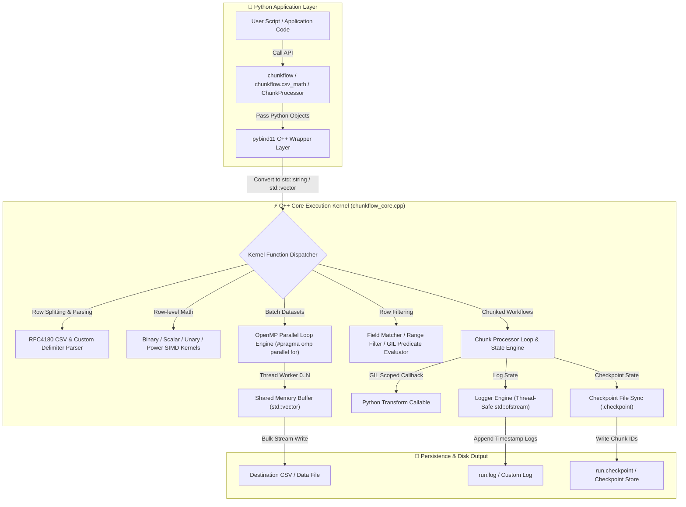
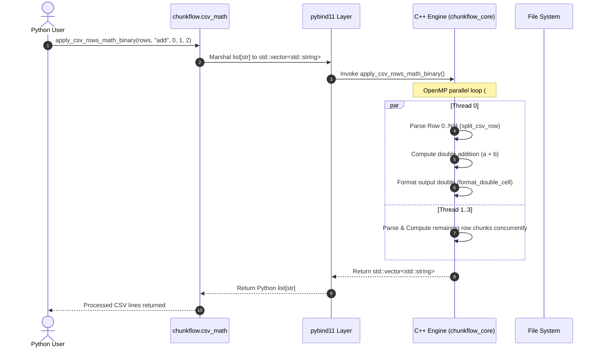
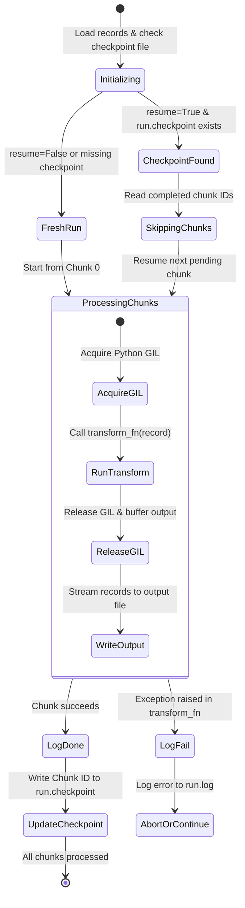

# 🌊 ChunkFlow Architecture & Project Flow

This document provides an exhaustive explanation of the execution workflow, architectural design, data lifecycle, and error recovery mechanics of **ChunkFlow**.

---

## 📐 Architecture Overview

ChunkFlow combines high-level Python ergonomics with low-level C++17 native performance. The execution pipeline crosses from Python managed memory into native unmanaged C++ data structures via **pybind11**, processes arrays using **OpenMP multi-threading**, and persists results with minimal overhead.



---

## 🔄 Detailed Step-by-Step Data Flow

### Step 1: Input Ingestion & Type Marshaling
1. The user invokes a function from `chunkflow.csv_math` or `chunkflow.chunking` with Python string rows, column indices, mathematical operators, or lambda callbacks.
2. **pybind11** intercepts the call:
   - Python strings are converted to `std::string` or `std::vector<std::string>`.
   - Numeric inputs (`int`, `float`) are translated into native C++ integer types and `double`.
   - Python callables are wrapped in `py::object` function handles.

### Step 2: C++ Parsing & Tokenization Mechanics
For CSV and custom-delimited rows, ChunkFlow avoids regular expressions or overhead-heavy string tokens:
- **`split_csv_row()`**: Reads characters sequentially. Tracks quote states (`in_quotes`), handles RFC4180 escaped quotes (`""`), and trims whitespace in-place via `trim_inplace()`.
- **`split_delimited_row()`**: Handles multi-character or non-comma delimiters (such as `\t`, `|`, `;`) with optional quote support.



### Step 3: Numeric Kernel Execution
- Cell contents are converted to IEEE 754 floating-point double precision values using high-speed string-to-double conversion (`parse_double_field` wrapping `std::stod`).
- Execution is dispatched to specialized static functions:
  - **Binary Math**: `apply_binary()` performs addition (`a + b`), subtraction (`a - b`), multiplication (`a * b`), or division (`a / b`). Checks for division-by-zero errors.
  - **Scalar Math**: `apply_scalar()` performs scalar transformations (`value op scalar`).
  - **Unary Math**: `apply_unary()` executes `sqrt()` (with negative number safety checks), `abs()`, `floor()`, or `ceil()`.
  - **Power Scaling**: `apply_csv_row_math_power()` executes `std::pow(value, exponent)`.

### Step 4: OpenMP Multi-Threaded Parallel Processing
- When processing list-based operations (`apply_csv_rows_math_*`), ChunkFlow applies OpenMP pragmas:
  ```cpp
  #pragma omp parallel for
  for (int i = 0; i < (int)rows.size(); ++i) {
      // Independent row processing without GIL interference
  }
  ```
- **Thread Safety & Exception Propagation**:
  - Thread iterations operate on separate indices of the output vector `std::vector<std::string> out(rows.size())`.
  - If a thread catches an exception (e.g. non-numeric data or division by zero), it sets an `error_flag` inside a `#pragma omp critical` block, ensuring clean cleanup and raising a standard Python exception.

### Step 5: Chunked Dataset Processing & Resumable Checkpoints
For large dataset workflows triggered via `chunkflow_core.process()`:



1. **Chunk Splitting**: Records are segmented into fixed-size chunks (e.g. 5,000 records per chunk).
2. **Resumption Verification**: If `resume=True`, ChunkFlow parses `checkpoint_path` to build an `unordered_set<int>` of completed chunk IDs.
3. **GIL Synchronization**: When calling back into Python user logic (`transform_fn`), the C++ thread acquires the Python GIL using `py::gil_scoped_acquire gil`, executes the transform, and releases the GIL immediately afterward.
4. **Logging & Checkpoint Sync**:
   - Every chunk completion or failure event is logged with timestamps (`YYYY-MM-DD HH:MM:SS`) to `log_path`.
   - Successful chunk IDs are appended immediately to `checkpoint_path`.

---

## 🔒 Memory Safety & Exception Handling

- **Zero Memory Leaks**: All dynamic allocations leverage C++ RAII (Resource Acquisition Is Initialization) via `std::vector` and `std::string`.
- **String Reserve Optimization**: Buffer string memory is reserved in advance (`cur.reserve(64)`, `out.reserve(fields.size() * 16)`) to eliminate reallocations during CSV construction.
- **Python Exception Interception**: C++ catches both standard `std::exception` instances and `py::error_already_set` exceptions, converting them into native Python `ValueError` or `RuntimeError` messages.
