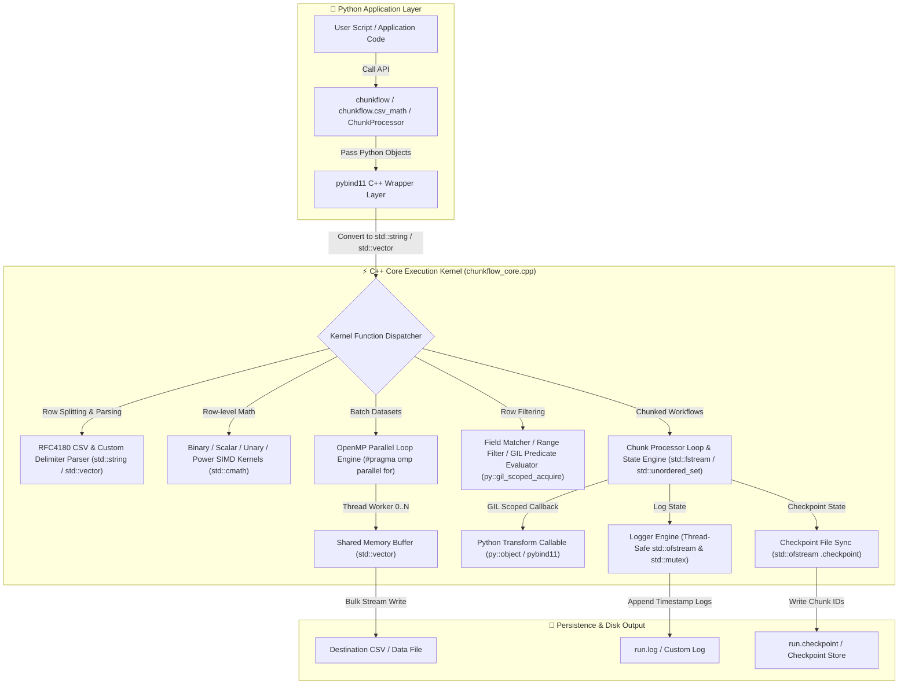
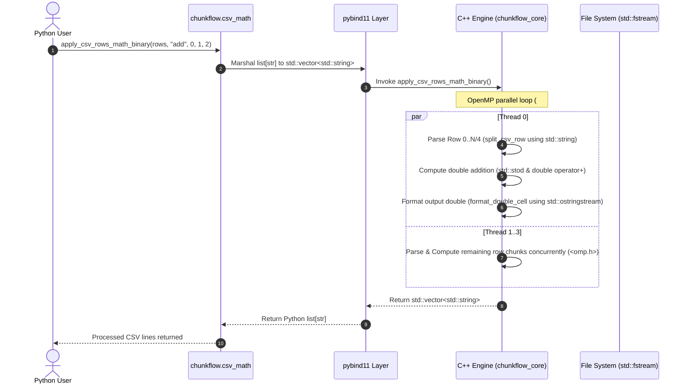

# 🌊 ChunkFlow Architecture & Project Flow

This document provides an exhaustive explanation of the execution workflow, architectural design, data lifecycle, library usage locations, and error recovery mechanics of **ChunkFlow**.

---

## 📐 Architecture Overview

ChunkFlow combines high-level Python ergonomics with low-level C++17 native performance. The execution pipeline crosses from Python managed memory into native unmanaged C++ data structures via **pybind11**, processes arrays using **OpenMP multi-threading**, and persists results with minimal overhead.



---

## 🔄 Detailed Step-by-Step Data Flow with Library Annotations

### Step 1: Input Ingestion & Type Marshaling
1. The user script invokes a function from `chunkflow.csv_math` or `chunkflow.chunking` with Python string rows, column indices, mathematical operators, or lambda callbacks.
2. **`pybind11` (`<pybind11/pybind11.h>`, `<pybind11/stl.h>`, `<pybind11/functional.h>`)** intercepts the call:
   - Python string lists are converted to C++ `std::vector<std::string>` containers.
   - Numeric inputs (`int`, `float`) are translated into native C++ integer types and `double`.
   - Python callables are wrapped in `py::object` function handles.

### Step 2: C++ Parsing & Tokenization Mechanics
For CSV and custom-delimited rows, ChunkFlow avoids regular expressions or overhead-heavy string tokens:
- **`split_csv_row()`** & **`split_delimited_row()`**: Read characters sequentially from C++ **`std::string`** (`<string>`).
- **`trim_inplace()`**: Strips whitespace using C++ **`<cctype>`** (`std::isspace`) without extra memory allocation.
- Results are stored in C++ **`std::vector<std::string>`** (`<vector>`).



### Step 3: Numeric Kernel Execution
- Cell contents are parsed via C++ **`<string>`** (`std::stod`) wrapped in non-throwing **`<optional>`** (`std::optional<double>`).
- Operations execute native floating point math via C++ **`<cmath>`**:
  - **Binary Math**: `apply_binary()` performs addition (`+`), subtraction (`-`), multiplication (`*`), or division (`/`). Checks for division-by-zero errors.
  - **Scalar Math**: `apply_scalar()` performs scalar operations (`value op scalar`).
  - **Unary Math**: `apply_unary()` executes **`<cmath>`** routines (`std::sqrt` with negative input validation, `std::fabs`, `std::floor`, `std::ceil`).
  - **Power Scaling**: `apply_csv_row_math_power()` executes **`<cmath>`** (`std::pow(value, exponent)`).
- Outputs are formatted into C++ **`std::string`** buffers using C++ **`<sstream>`** (`std::ostringstream` with `precision(17)`).

### Step 4: OpenMP Multi-Threaded Parallel Processing
- When processing list-based operations (`apply_csv_rows_math_*`), ChunkFlow applies **`OpenMP` (`<omp.h>`)** compiler pragmas:
  ```cpp
  #pragma omp parallel for
  for (int i = 0; i < (int)rows.size(); ++i) {
      // Independent row processing across CPU threads without GIL contention
  }
  ```
- **Thread Safety & Exception Propagation**:
  - Thread iterations write directly to distinct array indices in `std::vector<std::string> out(rows.size())`.
  - Exception handling uses **`OpenMP`** critical blocks (`#pragma omp critical`) to update atomic error flags safely across threads.

### Step 5: Chunked Dataset Processing & Resumable Checkpoints
For large dataset workflows triggered via `chunkflow_core.process()`:

```mermaid
stateDiagram-v2
    [*] --> Initializing: Load records & check checkpoint file
    Initializing --> CheckpointFound: resume=True & run.checkpoint exists (std::ifstream)
    Initializing --> FreshRun: resume=False or missing checkpoint

    CheckpointFound --> SkippingChunks: Read completed chunk IDs (std::unordered_set<int>)
    FreshRun --> ProcessingChunks: Start from Chunk 0

    SkippingChunks --> ProcessingChunks: Resume next pending chunk

    state ProcessingChunks {
        [*] --> AcquireGIL: Acquire Python GIL (py::gil_scoped_acquire)
        AcquireGIL --> RunTransform: Call transform_fn(record) (pybind11 py::object)
        RunTransform --> ReleaseGIL: Release GIL & buffer output (std::vector)
        ReleaseGIL --> WriteOutput: Stream records to output file (std::ofstream)
    }

    ProcessingChunks --> LogDone: Chunk succeeds (Logger & std::mutex)
    ProcessingChunks --> LogFail: Exception raised in transform_fn

    LogDone --> UpdateCheckpoint: Write Chunk ID to run.checkpoint (std::ofstream)
    LogFail --> AbortOrContinue: Log error to run.log (Logger)

    UpdateCheckpoint --> [*]: All chunks processed
```

1. **Chunk Splitting**: Records are partitioned into `std::vector<Chunk>` buffers using C++ **`<algorithm>`** (`std::min`).
2. **Resumption Verification**: C++ **`<fstream>`** (`std::ifstream`) reads `checkpoint_path` into a C++ **`<unordered_set>`** (`std::unordered_set<int>`) for $O(1)$ chunk lookup.
3. **GIL Synchronization**: The thread acquires the Python GIL via **`pybind11`** (`py::gil_scoped_acquire`), executes the Python callable via `py::object`, and releases the GIL upon exiting the scope.
4. **Logging & Checkpoint Sync**:
   - Timestamps are formatted using C++ **`<chrono>`** (`system_clock`) and **`<ctime>`** (`std::strftime`).
   - Logging writes to disk using C++ **`<fstream>`** (`std::ofstream`) protected by C++ **`<mutex>`** (`std::mutex` and `std::lock_guard`).
   - Completed chunk IDs are appended to `checkpoint_path` via `std::ofstream`.

---

## 🔒 Memory Safety & Exception Handling

- **Zero Memory Leaks**: All dynamic allocations leverage C++ RAII via **`<vector>`** (`std::vector`) and **`<string>`** (`std::string`).
- **String Reserve Optimization**: Buffer string memory is pre-reserved (`cur.reserve(64)`, `out.reserve(fields.size() * 16)`) to eliminate reallocations.
- **Python Exception Interception**: **`pybind11`** catches C++ `std::exception` and `py::error_already_set`, converting them into native Python `ValueError` or `RuntimeError` objects.
