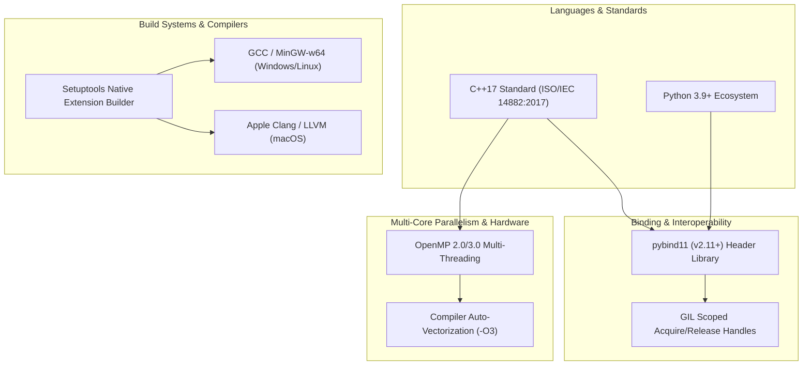

# 🛠️ ChunkFlow Technology Stack Reference

This document provides a deep dive into the technology stack, compilers, runtime flags, parallel computing models, and binding mechanisms powering **ChunkFlow**.

---

## 📑 Core Technology Breakdown



---

## 1. C++17 Native Engine

### Why C++17?
- **Standardized Double Conversion**: Fast string-to-numeric parsing via stdlib functions.
- **`std::optional` & `std::variant` Support**: Clean error-handling paradigms for field parsing without expensive exception throws during normal iteration.
- **Move Semantics (`std::move`)**: Enables zero-copy memory transfers when parsing strings and building `std::vector<std::string>` containers.

### High-Performance String & Memory Optimization
- **`std::string::reserve()`**: String buffers pre-allocate memory before parsing or formatting cells to avoid expensive heap reallocations.
- **In-place Whitespace Trimming**: `trim_inplace()` strips leading/trailing space directly on string views or buffers without allocating temporary copies.

---

## 2. pybind11 C++/Python Binding Layer

### Architecture
ChunkFlow uses **pybind11** (v2.11+) to expose C++ routines directly to Python as a C-extension module (`chunkflow_core`).

### Key Implementation Mechanics
1. **Type Mapping**:
   - `std::string` $\longleftrightarrow$ Python `str` (UTF-8 encoded).
   - `std::vector<std::string>` $\longleftrightarrow$ Python `list` of `str`.
   - `double`, `int`, `bool` $\longleftrightarrow$ Native Python numeric types.
   - `py::object` $\longleftrightarrow$ Wrapped Python callables/lambdas.

2. **Global Interpreter Lock (GIL) Management**:
   When processing chunk transformations in C++, thread synchronization requires careful GIL handling:
   ```cpp
   // Acquire Python GIL before calling Python transform lambda
   py::gil_scoped_acquire gil;
   py::object result = transform_fn(py::str(item));
   // GIL is automatically released when 'gil' variable leaves scope (RAII)
   ```

3. **Exception Translation**:
   All C++ `std::invalid_argument` or `std::runtime_error` exceptions automatically convert to Python `ValueError` or `RuntimeError` objects without process crashes.

---

## 3. OpenMP Multi-Core Parallel Processing

### Parallel Loop Vectorization
For batch row list math (`apply_csv_rows_math_*`), ChunkFlow bypasses Python multi-processing overhead by spawning OpenMP worker threads natively in C++:

```cpp
#pragma omp parallel for
for (int i = 0; i < (int)rows.size(); ++i) {
    // Each thread processes row i concurrently in shared memory
    out[i] = apply_csv_row_math_binary(rows[i], op, col_left, col_right, col_out);
}
```

### Thread Safety & Thread-Local Storage
- **No Shared State Mutation**: Each thread writes strictly to its designated index `out[i]`, avoiding data races.
- **Critical Sections**: When catching exceptions within worker threads, ChunkFlow uses `#pragma omp critical` to safely write error messages without race conditions.

---

## 4. Platform Compilers & Build Flag Matrix

ChunkFlow's `setup.py` automatically detects host OS platforms and applies optimized compiler flags:

| Target Platform | Compiler / Toolchain | Extra Compile Flags (`extra_compile_args`) | Extra Link Flags (`extra_link_args`) |
| :--- | :--- | :--- | :--- |
| **Windows 64-bit** | MinGW-w64 (`gcc` / `g++`) | `-O3`, `-std=c++17`, `-fopenmp`, `-DMS_WIN64`, `-D_hypot=hypot`, `-fno-strict-aliasing` | `-fopenmp`, `-static-libgcc`, `-static-libstdc++` |
| **macOS** | Apple Clang / LLVM + Homebrew | `-O3`, `-std=c++17`, `-Xpreprocessor`, `-fopenmp` | `-lomp` |
| **Linux** | GCC / Clang | `-O3`, `-std=c++17`, `-fopenmp` | `-fopenmp` |

### Key Flag Explanations
- **`-O3`**: Maximum compiler optimization (loop unrolling, instruction vectorization, inline function expansion).
- **`-DMS_WIN64`**: Informs pybind11 that compilation is targeting 64-bit Windows environments under MinGW.
- **`-static-libgcc` / `-static-libstdc++`**: Bundles runtime libraries directly into the `.pyd` file on Windows to prevent DLL dependency missing errors.

---

## 5. Python Package Ecosystem & Testing Tools

- **Setuptools**: Package setup and building tool configuring `Extension("chunkflow_core", ...)` compilation.
- **Pytest**: Industry-standard test runner used for executing unit tests in `tests/`.
- **Pandas & NumPy**: Utilized in `datasetgen.py` for generating synthetic 100,000+ row benchmark CSV datasets.
